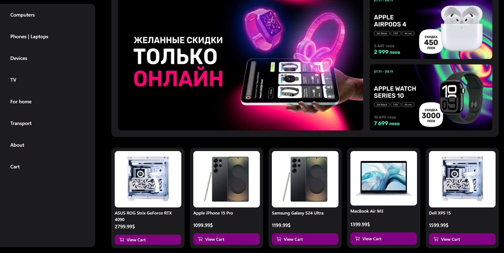
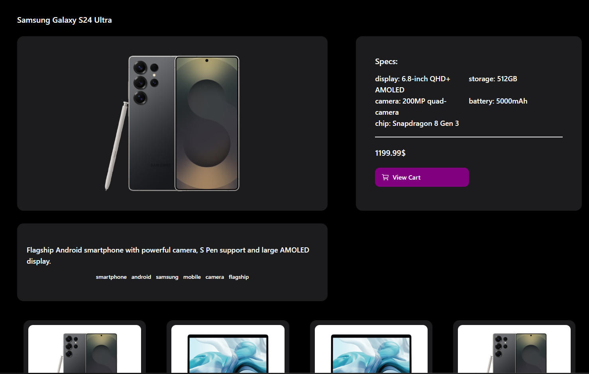

# Horoshenkii

## E-Commerce React App

> [!NOTE]
> **About the project**: This project is a fully responsive e-commerce application built with **React**, **React Router** and **Tailwind CSS**

## Tech Stack

| Category | Technologies              |
| -------- | ------------------------- |
| Frontend | React, React Router       |
| Styling  | Tailwind CSS              |
| State    | Context API, LocalStorage |
| UI       | Swiper.js                 |
| Build    | Vite                      |

## Features

- Fully responsive layout
- Product catalog
- Detailed product pages
- Shopping cart
- Light/Dark mode
- Image sliders (Swiper)
- Fast and optimized




## Project Structure

src/
components/
pages/
context/
data/
public/

## Installation & Running

```bash
npm install
npm run dev
```
